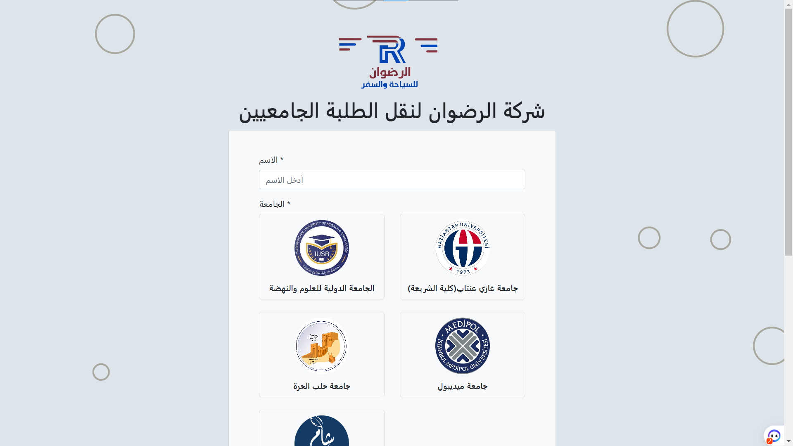
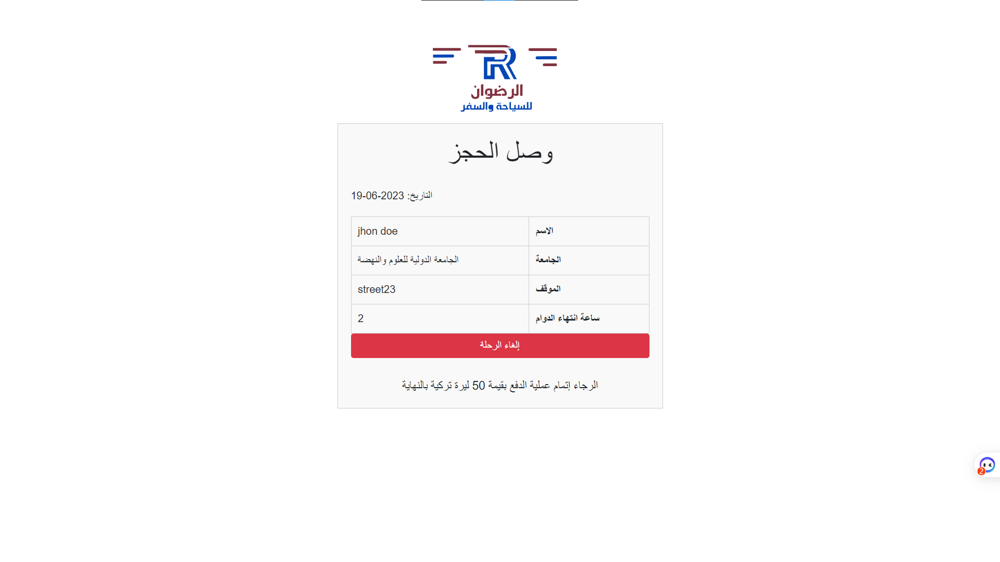
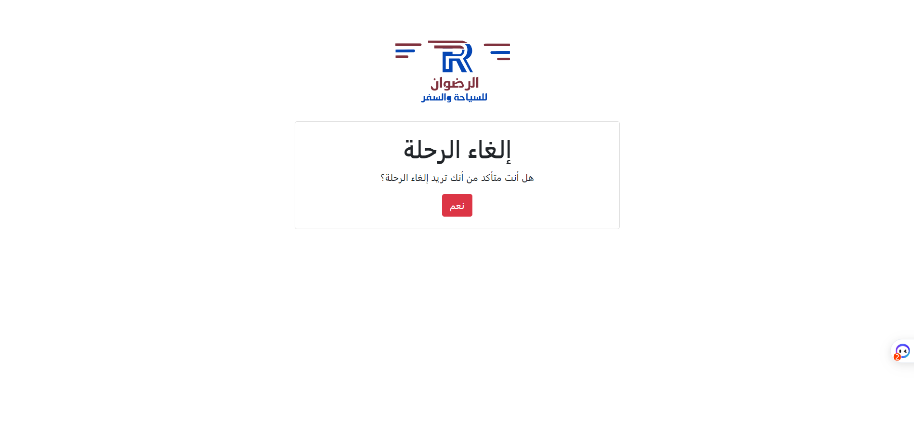
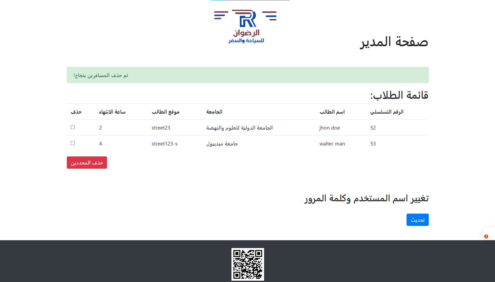

# Bus Reservation Website

This website is designed to facilitate seat reservation for bus trips based on university affiliation and individual departure times. It allows students to book seats on buses for both one-way and round-trip journeys.

## Features

- **University-based Reservation**: Students can select their university from a list and view available bus trips specifically catering to their institution.
- **Departure Time Selection**: Each student can choose their preferred departure time for both the outbound and return trips.
- **Seat Reservation**: Students can reserve seats on the buses for their desired travel dates and times.
- **Dynamic Seat Availability**: The website provides real-time updates on seat availability, allowing students to make informed decisions during the reservation process.
- **Cancellation Option**: In case of changes in travel plans, students have the option to cancel their reservations and free up seats for other users.

## Screenshots

## Getting Started

To run the website locally, follow these steps:

1. Clone the repository: `git clone https://github.com/username/repository.git`
2. Install the necessary dependencies: `npm install`
3. Start the local development server: `npm start`
4. Open your web browser and navigate to `http://localhost:3000` to access the website.

## Technologies Used

- HTML5, CSS3, and JavaScript for the front-end
- PHP for server-side scripting
- MySQL database for storing and retrieving reservation data
- Bootstrap framework for responsive design
- Node.js and Express.js for the development server

## Contributors

- Mohammad Adnan Jaded
- Mustafa Brooky

Please feel free to contribute by submitting bug reports, feature requests, or pull requests. For major changes, please open an issue first to discuss the proposed changes.

## License

This project is licensed under the [MIT License](LICENSE).
